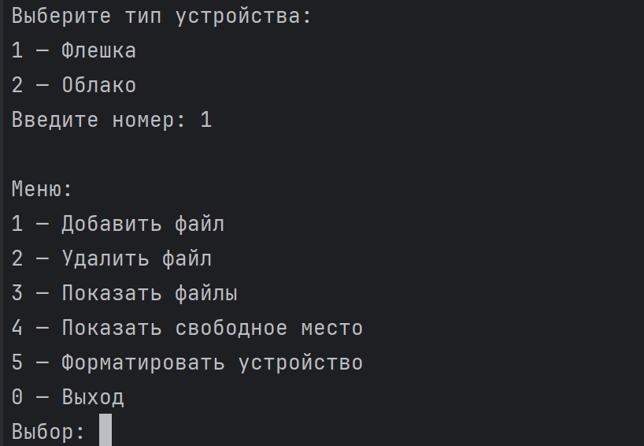

💾 Storage Manager (на Go)
Консольное приложение для управления файлами на устройствах хранения: флешке или облачном диске.

📌 Описание
Storage Manager — это интерактивное CLI-приложение на языке Go, моделирующее поведение устройств хранения данных. Пользователь может выбрать тип устройства (флешка или облако) и выполнять базовые операции: добавление и удаление файлов, просмотр содержимого, проверку свободного пространства и форматирование.

Приложение демонстрирует:

принципы композиции и интерфейсов в Go,

обработку пользовательского ввода через консоль,

объектно-ориентированный подход через структуры и методы.

🚀 Как запустить
Установите Go (версии 1.18 или выше).

Склонируйте репозиторий:

bash
Копировать
Редактировать
git clone https://github.com/TrueMisha/oop_go_project.git
cd oop_go_project
Запустите приложение:

bash
Копировать
Редактировать
go run main.go

🧱 Структура проекта
go
Копировать
Редактировать
oop-go/
├── main.go — точка входа
├── ui/
│   └── cli.go — интерфейс командной строки
└── storage/
├── file.go — описание структуры File
├── base.go — базовая логика хранения
├── flash.go — реализация флешки
├── cloud.go — реализация облака
└── interface.go — интерфейс StorageDevice

🧰 Возможности
💽 Выбор устройства хранения:

Флешка (1000 МБ)

Облако (500 МБ)

📁 Добавление файлов (с проверкой на размер)

❌ Удаление файлов по имени

📜 Просмотр списка файлов

📊 Просмотр свободного места

🧹 Форматирование устройства (удаление всех файлов)

💡 Простая навигация по меню и обработка пользовательских ошибок

🖼️ Пример интерфейса
makefile

📖 Примеры использования
Добавить файл "music.mp3" размером 100 МБ

Удалить файл "photo.jpg"

Посмотреть список файлов и свободное место

Форматировать флешку и начать заново

🔧 Технологии
Язык программирования: Go

Работа с консолью: bufio, fmt, os, strconv, strings

Архитектура: интерфейсы + композиция (вместо наследования)

🧪 Идеи для расширения
💾 Сохранение состояния в файл

🔐 Авторизация для облака

⏳ Ограничение по времени хранения файлов

🌐 Веб-версия интерфейса на Go с использованием Gin

